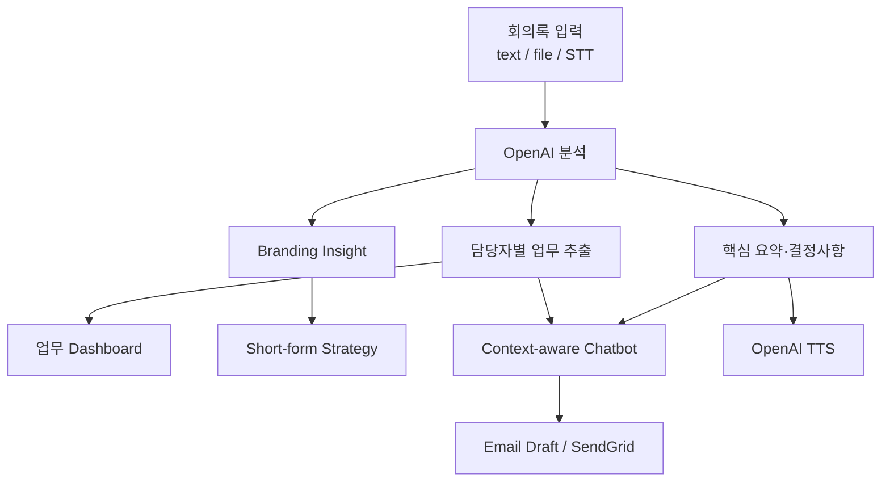

# AIVLE AI Assistant

> 회의록을 요약하는 데서 끝내지 않고 담당 업무, 전략안, 실행 상태, 숏폼 기획과 이메일 briefing까지 연결한 Streamlit 업무 보조 MVP

**상태:** Prototype · **AI:** OpenAI API · **데이터 저장:** `st.session_state`


이 프로젝트는 `20년 된 장수 브랜드의 Z세대 리브랜딩`이라는 가상 업무 시나리오를 사용합니다. 사용자는 회의록을 입력하거나 음성으로 변환한 뒤, 회의 결과를 실제 후속 업무로 옮기는 과정을 한 앱에서 시연할 수 있습니다.

## 회의 이후의 작업 흐름



앱 상태는 같은 Streamlit session 안에서 dashboard, task, short-form, chatbot page가 공유합니다. 외부 database는 사용하지 않습니다.

## 핵심 기능

### 회의 분석

- 직접 입력 또는 TXT/Markdown upload
- `whisper-1` 기반 음성 transcription
- 회의 목적·논의·결정사항·실행 risk 정리
- 담당자·마감일·우선순위를 포함한 task 추출
- 이전 회의와 현재 회의 비교

### 실행 관리

- task table, card, flow view
- `진행 예정 → 진행 중 → 검토 중 → 완료` 상태 관리
- 담당자·우선순위·마감일 편집
- 역할별 page 접근 흐름

### 콘텐츠와 전달

- Z세대 대상 short-form 전략
- 60초 script와 A/B test idea
- 현재 회의록·분석 결과·task를 참고하는 chatbot
- `tts-1` 기반 결과 음성 생성
- SendGrid를 통한 email briefing

뉴스/사례 추천은 실제 검색 API 결과가 아니라 `gpt-4o-mini`가 생성한 예시입니다. 출처·날짜·URL이 검증된 뉴스 검색 기능으로 취급하지 않습니다.

## 화면

| 로그인 | 업무 Dashboard |
|---|---|
|  |  |

| Short-form Studio | Chatbot |
|---|---|
|  |  |

세부 화면은 [`docs/screenshots/`](docs/screenshots/)에서 확인할 수 있습니다.

## 역할과 구현 범위

저장소에서 확인되는 구현 범위는 다음과 같습니다.

- Streamlit multi-page 앱과 공통 UI
- 역할 선택형 간이 로그인
- OpenAI chat completion 기반 분석 함수
- Whisper STT와 OpenAI TTS
- task 추출·편집·상태 관리
- short-form 전략·script·A/B test 생성
- session context를 사용하는 chatbot
- SendGrid email 발송

실제 계정 인증, database, background job, 검색 기반 RAG는 구현되어 있지 않습니다.

## 로컬 실행

요구 사항: Python 3.10 이상 권장

```powershell
git clone https://github.com/Jaeukss/https-github.com-ukss-minip3.git
cd https-github.com-ukss-minip3
python -m pip install -r requirements.txt
python -m streamlit run app.py
```

샘플 회의록은 루트의 `meeting1.txt`를 사용합니다.

## 환경변수

실제 코드가 읽는 secret은 다음 두 개입니다.

```toml
# .streamlit/secrets.toml
OPENAI_API_KEY = "your_openai_api_key"
SENDGRID_API_KEY = "your_sendgrid_api_key"
```

또는 현재 PowerShell session에 설정할 수 있습니다.

```powershell
$env:OPENAI_API_KEY="your_openai_api_key"
$env:SENDGRID_API_KEY="your_sendgrid_api_key"
python -m streamlit run app.py
```

`.env.example`은 필요한 변수명을 보여주는 참고 파일이며, 현재 코드에는 `python-dotenv`가 없어 `.env`를 자동으로 읽지 않습니다.

`EMAIL_ADDRESS`는 현재 `shared.py`의 verified sender 상수로 고정되어 있습니다. 환경변수로 변경하는 기능은 구현되지 않았으며, 다른 SendGrid 계정으로 배포하려면 코드 수정과 sender verification이 필요합니다.

## 사용 중인 OpenAI 기능

| 기능 | Model/API |
|---|---|
| 회의·task·전략·chat 생성 | `gpt-4o-mini` |
| 음성 입력 | `whisper-1` |
| 음성 출력 | `tts-1` |

`OPENAI_API_KEY`가 없으면 OpenAI client를 사용하는 기능은 중단됩니다. 이 프로젝트에는 local AI fallback이 없습니다.

## 파일 구조

```text
.
├── app.py                     # 로그인과 앱 진입
├── shared.py                  # OpenAI, STT/TTS, 공통 state와 UI
├── pages/
│   ├── 1_dashboard.py         # 회의 분석과 email
│   ├── 2_shortform.py         # 전략·script·A/B test
│   ├── 3_tasks.py             # task 관리
│   └── 4_chatbot.py           # context chatbot과 email
├── docs/screenshots/          # 실제 화면
├── assets/able_bunny.png
├── meeting1.txt               # 샘플 회의록
├── .env.example
└── requirements.txt
```

## 기술 구성

| 영역 | 기술 | 사용 목적 |
|---|---|---|
| Web | Streamlit | multi-page UI |
| AI | OpenAI Python SDK | chat, STT, TTS |
| Email | SendGrid REST API | briefing 발송 |
| Data | pandas, JSON | task와 state 구조 |
| State | `st.session_state` | page 간 실행 상태 공유 |

## 현재 제약

- 로그인은 역할을 선택하는 demo flow이며 실제 인증이 아닙니다.
- 회의록, task, 결과는 session 종료 후 유지되지 않습니다.
- email sender가 코드 상수로 고정되어 있습니다.
- 뉴스 추천은 검색·검증된 기사 목록이 아닙니다.
- 사용자별 권한, 감사 log, 비용 monitor가 없습니다.
- 입력한 회의록과 생성 결과를 외부 API로 전송하므로 민감정보 사용 전 별도 검토가 필요합니다.
